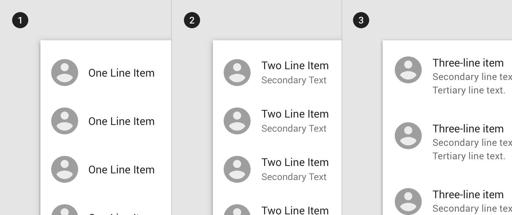
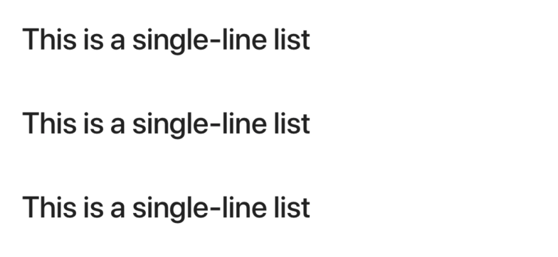
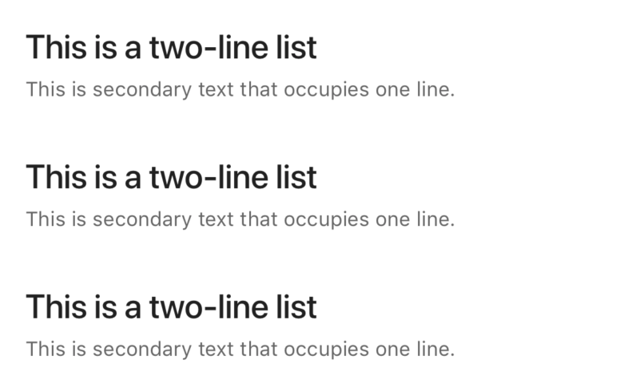
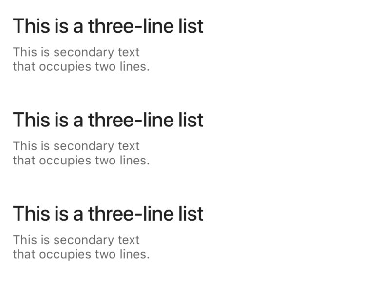
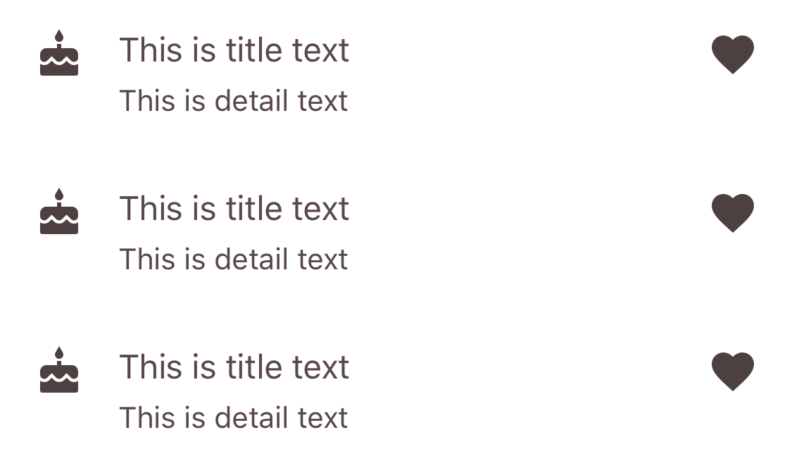

<!--docs:
title: "Lists"
layout: detail
section: components
excerpt: "Lists are continuous, vertical indexes of text or images."
iconId: <#icon_id#>
path: /catalog/list/
api_doc_root: true
-->

# Lists

[](https://github.com/material-components/material-components-ios/issues?q=is%3Aopen+is%3Aissue+label%3Atype%3ABug+label%3A%5BList%5D)

[Lists](https://material.io/components/lists/) are continuous, vertical indexes of text or images.

There are three list types:
1. [Single-line list](#single-line-list)
1. [Two-line list](#two-line-list)
1. [Three-line list](#three-line-list)



## Contents

* [Using lists](#using-lists)
* [Installing lists](#installing-lists)
* [Making lists accessible](#making-lists-accessible)
* [List anatomy](#list-anatomy)
* [Types of lists](#types-of-list)
* [Theming lists](#theming-lists)
* [Building your own list item](#building-your-own-list-item)

- - -

## Using lists

We currently offer two `UICollectionViewCell` subclasses that can be used to create Material Design lists: `MDCBaseCell` and `MDCSelfSizingStereoCell`. 

### `MDCBaseCell`

The `MDCBaseCell` is a list item at its simplest--a `UICollectionViewCell` subclass with ripple and elevation. The `MDCBaseCell` provides a starting point to build anything demonstrated in the extensive [design guidelines](https://material.io/go/design-lists). To build a list using `MDCBaseCell` simply treat it like you would any other `UICollectionViewCell`.

<div class="article__asset article__asset--screenshot">
  
</div>

### `MDCSelfSizingStereoCell`

The `MDCSelfSizingStereoCell` is a subclass of `MDCBaseCell`. It exposes two image views (trailing and leading) and two labels (title and detail) that the user can configure however they like.

<div class="article__asset article__asset--screenshot">
  
</div>

Because the list items we provide inherit from `UICollectionViewCell`, clients are not expected to instantiate them themselves. Rather, clients should register the cell classes with `UICollectionViews`, and then cast the cells to the correct class in their implementations of `-collectionView:cellForItemAtIndexPath:`.

<!--<div class="material-code-render" markdown="1">-->
#### Swift

```swift
// registering the cell
collectionView.register(MDCBaseCell.self, forCellWithReuseIdentifier: "baseCellIdentifier")

// casting the cell to the desired type within `-collectionView:cellForItemAtIndexPath:`
guard let cell = collectionView.cellForItem(at: indexPath) as? MDCBaseCell else { fatalError() }
```

#### Objective-C

```objc
// registering the cell
[self.collectionView registerClass:[MDCBaseCell class]
        forCellWithReuseIdentifier:@"BaseCellIdentifier"];

// casting the cell to the desired type within `-collectionView:cellForItemAtIndexPath:`
MDCBaseCell *cell =
    [collectionView dequeueReusableCellWithReuseIdentifier:@"BaseCellIdentifier"
                                              forIndexPath:indexPath];
```
<!--</div>-->

## Installing lists

In order to install lists with Cocoapods first add the List component subspec to your `Podfile`:

```bash
pod 'MaterialComponents/List'
```
<!--{: .code-renderer.code-renderer--install }-->

Then, run the following command:

```bash
pod install
```

From there, import the component:

<!--<div class="material-code-render" markdown="1">-->
#### Swift
```swift
import MaterialComponents.MaterialList
```

#### Objective-C

```objc
#import "MaterialList.h"
```
<!--</div>-->

## Making lists accessible

To help ensure your Lists are accessible to as many users as possible, please be sure to review the following recommendation:

### Setting `-isAccessibilityElement`

It is generally recommended to set UICollectionViewCells (and UITableViewCells) as accessibilityElements. That way, VoiceOver doesn't traverse the entire cell and articulate an overwhelming amount of accessibility information for each of its subviews.

<!--<div class="material-code-render" markdown="1">-->
#### Swift
```swift
cell.isAccessibilityElement = true
```

#### Objective-C

```objc
cell.isAccessibilityElement = YES;
```
<!--</div>-->

## List anatomy

The following is a typical list anatomy diagram that applies to single-line, two-line, and three-line lists:


This list item consists of the following attributes:
1. Leading image view
1. Title label and detail label
1. Trailing label

It is important to note that `MDCSelfSizingStereoCell` currently only supports leading and trailing _image views_, so the trailing label in this case would have to be represented by a `UIImageView`.

An instance of `MDCSelfSizingStereoCell` can be configured to be a single-line, two-line, or three-line list item. The features above map to the following propertieis and methods:

#### Container attributes

&nbsp;        | **Attribute**        | **Related methods**      | **Default value**
------------- | -------------------- | ------------------------ | -----------------
**Color**     | `rippleColor` | `-setRippleColor:` <br/> `-setRippleColor` | On surface color at 0.16 opacity
**Elevation** | `elevation`      | `-setElevation:` <br/> `-elevation` | 0

#### Icon attributes

&nbsp;               | **Attribute**                         | **Related methods**                                              | **Default value**
-------------------- | ------------------------------------- | ---------------------------------------------------------------- | -----------------
**Leading image**            | `leadingImageView`            | N/A  | N/A
**Trailing image**            | `trailingImageView`          | N/A  | N/A

#### Text label attributes

&nbsp;                    | **Attribute**                          | **Related methods**                                                 | **Default value**
------------------------- | -------------------------------------- | ------------------------------ | -----------------
**Title text**            |`titleLabel`                             | N/A                           | N/A
**Detail text**            |`titleLabel`                              | N/A                          | N/A

## Types of list

### Single-line list

Single-line list items contain a maximum of one line of text.

### Single-line list example



<!--<div class="material-code-render" markdown="1">-->
#### Objective-C

```objc
- (UICollectionViewCell *)collectionView:(UICollectionView *)collectionView
                  cellForItemAtIndexPath:(NSIndexPath *)indexPath {
  MDCSelfSizingStereoCell *cell =
      (MDCSelfSizingStereoCell *)[collectionView dequeueReusableCellWithReuseIdentifier:kSelfSizingStereoCellIdentifier
                                                forIndexPath:indexPath];
  cell.titleLabel.text = @"This is a single-line list";
  return cell;
}
```

#### Swift

```swift
func collectionView(_ collectionView: UICollectionView,
                    cellForItemAt indexPath: IndexPath) -> UICollectionViewCell {
  guard cell = collectionView.dequeueReusableCell(
    withReuseIdentifier: kSelfSizingStereoCellIdentifier,
    for: indexPath)
    as? MDCCollectionViewTextCell
    else { return }
  cell.titleLabel.text = "This is a single-line list"
  return cell
}
```
<!--</div>-->

### Two-line list

Two-line list items contain a maximum of two lines of text.

### Two-line list example



<!--<div class="material-code-render" markdown="1">-->
#### Objective-C

```objc
- (UICollectionViewCell *)collectionView:(UICollectionView *)collectionView
                  cellForItemAtIndexPath:(NSIndexPath *)indexPath {
  MDCSelfSizingStereoCell *cell =
      [collectionView dequeueReusableCellWithReuseIdentifier:kSelfSizingStereoCellIdentifier
                                                forIndexPath:indexPath];
  cell.titleLabel.text = @"This is a two-line list";
  cell.detailLabel.text = @"This is secondary text that occupies one line.";
  return cell;
}
```

#### Swift

```swift
func collectionView(_ collectionView: UICollectionView,
                    cellForItemAt indexPath: IndexPath) -> UICollectionViewCell {
  guard cell = collectionView.dequeueReusableCell(
    withReuseIdentifier: kSelfSizingStereoCellIdentifier,
    for: indexPath)
    as? MDCCollectionViewTextCell
    else { return }
  cell.titleLabel.text = "This is a two-line list"
  cell.detailLabel.text = "This is secondary text that occupies one line."
  return cell
}
```
<!--</div>-->

### Three-line list

Three-line list items contains a maximum of three lines of text.

### Three-line list example



<!--<div class="material-code-render" markdown="1">-->
#### Objective-C

```objc
- (UICollectionViewCell *)collectionView:(UICollectionView *)collectionView
                  cellForItemAtIndexPath:(NSIndexPath *)indexPath {
  MDCSelfSizingStereoCell *cell =
      [collectionView dequeueReusableCellWithReuseIdentifier:kSelfSizingStereoCellIdentifier
                                                forIndexPath:indexPath];
  cell.titleLabel.text = @"This is a three-line list";
  cell.detailLabel.text = @"This is secondary text\nthat occupies two lines.";
  return cell;
}
```

#### Swift

```swift
func collectionView(_ collectionView: UICollectionView,
                    cellForItemAt indexPath: IndexPath) -> UICollectionViewCell {
  guard cell = collectionView.dequeueReusableCell(
    withReuseIdentifier: kSelfSizingStereoCellIdentifier,
    for: indexPath)
    as? MDCCollectionViewTextCell
    else { return }
  cell.titleLabel.text = "This is a three-line list"
  cell.detailLabel.text = "This is secondary text\nthat occupies two lines."
  return cell
}
```
<!--</div>-->

## Theming lists

This is an example of a two-line list with Shrine theming:



To theme a list item in your own app, use the Material Theming extension. To do that, first add the
Theming extension to your project:

```bash
pod `MaterialComponents/List+Theming`
```

<!--<div class="material-code-render" markdown="1">-->
#### Swift

```swift
// Step 1: Import the theming extension
import MaterialComponents.MaterialList_Theming

// Step 2: Create a shared container scheme. A shared scheme should be created once in your app and
// shared with all components.
let containerScheme = MDCContainerScheme()

// Step 3: Apply the scheme to each cell - from within `collectionView(_:cellForItemAt:)`
cell.applyTheme(withScheme:containerScheme)
```

#### Objective-C

```objc
// Step 1: Import the theming extension
#import "MaterialList+Theming.h"

// Step 2: Create a shared container scheme. A shared scheme should be created once in your app and
// shared with all components.
id<MDCContainerScheming> containerScheme = [[MDCContainerScheme alloc] init];

// Step 3: Apply the scheme to each cell - from within `-collectionView:cellForItemAtIndexPath:`
[cell applyThemeWithScheme:containerScheme];
```
<!--</div>-->

## Building your own list item

<!-- Extracted from docs/create-your-own.md -->

The example files can be found <a href="examples/">here</a>


Our example consists of a custom `UICollectionViewController`: <a
href="examples/CollectionListCellExampleTypicalUse.m">examples/CollectionListCellExampleTypicalUse.m</a>
and also of a custom `UICollectionViewCell`: <a
href="examples/supplemental/CollectionViewListCell.m">examples/supplemental/CollectionViewListCell.m</a>.

The main focus will be on the custom cell as that's where all the logic goes
in, whereas the collection view and its controller are using mostly
boilerplate code of setting up a simple example and collection view.

### Layout

For our example we will have a layout consisting of a left aligned
`UIImageView`, a title text `UILabel` and a details text `UILabel`. The title
text will have a max of 1 line whereas the details text can be up to 3 lines.
It is important to note that neither the image nor the labels need to be set.
To see more of the spec guidelines for Lists please see here: <a
href="https://material.io/go/design-lists">https://material.io/go/design-lists</a>

To create our layout we used auto layout constraints that are all set up in
the `(void)setupConstraints` method in our custom cell. It is important to
make sure we set `translatesAutoresizingMaskIntoConstraints` to `NO` for all
the views we are applying constraints on.

### Ink Ripple

Interactable Material components and specifically List Cells have an ink
ripple when tapped on. To add ink to your cells there are a few steps you need
to take:

1. Add an `MDCInkView` property to your custom cell.

2. Initialize `MDCInkView` on init and add it as a subview:

<!--<div class="material-code-render" markdown="1">-->
#### Objective-C

```objc
_inkView = [[MDCInkView alloc] initWithFrame:self.bounds];
_inkView.usesLegacyInkRipple = NO;
[self addSubview:_inkView];
```

#### Swift

```swift
let inkView = MDCInkView(frame: bounds)
inkView.usesLegacyInkRipple = false
addSubview(inkView)
```
<!--</div>-->

3. Initialize a `CGPoint` property in your cell (`CGPoint _lastTouch;`) to
indicate where the last tap was in the cell.

4. Override the `UIResponder`'s `touchesBegan` method in your cell to identify
and save where the touches were so we can then start the ripple animation from
that point:

<!--<div class="material-code-render" markdown="1">-->
#### Objective-C

```objc
- (void)touchesBegan:(NSSet *)touches withEvent:(UIEvent *)event {
  UITouch *touch = [touches anyObject];
  CGPoint location = [touch locationInView:self];
  _lastTouch = location;

  [super touchesBegan:touches withEvent:event];
}
```

#### Swift

```swift
override func touchesBegan(_ touches: Set<UITouch>, with event: UIEvent?) {
  let touch = touches.first
  let location = touch?.location(in: self)
  lastTouch = location
}
```
<!--</div>-->

5. Override the `setHighlighted` method for your cell and apply the start and
stop ripple animations:

<!--<div class="material-code-render" markdown="1">-->
#### Objective-C

```objc
- (void)setHighlighted:(BOOL)highlighted {
  [super setHighlighted:highlighted];
  if (highlighted) {
    [_inkView startTouchBeganAnimationAtPoint:_lastTouch completion:nil];
  } else {
    [_inkView startTouchEndedAnimationAtPoint:_lastTouch completion:nil];
  }
}
```

#### Swift

```swift
override var isHighlighted: Bool {
  set {
    super.isHighlighted = newValue
    if (newValue) {
      inkView.startTouchBeganAnimation(at: lastTouch, completion: nil)
    } else {
      inkView.startTouchEndedAnimation(at: lastTouch, completion: nil)
    }
  }
  // get...
}
```
<!--</div>-->

6. When the cell is reused we must make sure no outstanding ripple animations
stay on the cell so we need to clear the ink before:

<!--<div class="material-code-render" markdown="1">-->
#### Objective-C

```objc
- (void)prepareForReuse {
  [_inkView cancelAllAnimationsAnimated:NO];
  [super prepareForReuse];
}
```

#### Swift

```swift
override func prepareForReuse() {
  inkView.cancelAllAnimations(animated: false)
  super.prepareForReuse()
}
```
<!--</div>-->

Now there is ink in our cells!

### Self Sizing

In order to have cells self-size based on content and not rely on magic number
constants to decide how big they should be, we need to follow these steps:

1. Apply autolayout constraints of our added subviews relative to each other
and their superview (the cell's `contentView`). We need to make sure our
constraints don't define static heights or widths but rather constraints that
are relative or our cell won't calculate itself based on the dynamically sized
content.

You can see how it is achieved in the `setupConstraints` method in our
example. If you'll notice there are some constraints that are set up to be
accessible throughout the file:

<!--<div class="material-code-render" markdown="1">-->

#### Objective-C
```objc
NSLayoutConstraint *_imageLeftPaddingConstraint;
NSLayoutConstraint *_imageRightPaddingConstraint;
NSLayoutConstraint *_imageWidthConstraint;
``` 

#### Swift
```swift
var imageLeftPaddingConstraint: NSLayoutConstraint
var imageRightPaddingConstraint: NSLayoutConstraint
var imageWidthConstraint: NSLayoutConstraint
```
<!--</div>-->

This is in order to support the changing layout if an image is set or not.

2. Because our list cells need to fill the entire width of the collection
view, we want to expose the cell's width to be settable by the view controller
when the cell is set up. For that we expose a `setCellWidth` method that sets
the width constraint of the `contentView`:

<!--<div class="material-code-render" markdown="1">-->

#### Objective-C
```objc
- (void)setCellWidth:(CGFloat)width {
  _cellWidthConstraint.constant = width;
  _cellWidthConstraint.active = YES;
}
```

#### Swift
```swift
func set(cellWidth: CGFloat) {
  cellWidthConstraint.constant = cellWidth
  cellWidthConstraint.isActive = true
}
```
<!--</div>-->

and then in the collection view's `cellForItemAtIndexPath` delegate method we
set the width:

<!--<div class="material-code-render" markdown="1">-->

#### Objective-C
```objc
CGFloat cellWidth = CGRectGetWidth(collectionView.bounds);
if (@available(iOS 11.0, *)) {
  cellWidth -=
    (collectionView.adjustedContentInset.left + collectionView.adjustedContentInset.right);
}
[cell setCellWidth:cellWidth];
```

#### Swift
```swift
var cellWidth = collectionView.bounds.width
if #available(iOS 11.0, *) {
  cellWidth -= collectionView.adjustedContentInset.left + collectionView.adjustedContentInset.right
}
set(cellWidth: cellWidth)
```
<!--</div>-->

3. In our collection view's flow layout we must set an `estimatedItemSize` so
the collection view will defer the size calculations to its content.

Note: It is better to set the size smaller rather than larger or constraints
might break in runtime.

<!--<div class="material-code-render" markdown="1">-->

#### Objective-C
```objc
_flowLayout.estimatedItemSize = CGSizeMake(kSmallArbitraryCellWidth, kSmallestCellHeight);
```

#### Swift
```swift
flowLayout.estimatedItemSize = CGSize(width: kSmallArbitraryCellWidth, 
                                     height: kSmallestCellHeight)
```
<!--</div>-->

### Typography

For our example we use a typography scheme to apply the fonts to our cell's
`UILabel`s. Please see <a href="../schemes/Typography">Typography
Scheme</a> for more information.

### Dynamic Type

<a
href="https://developer.apple.com/ios/human-interface-guidelines/visual-design/typography/">Dynamic
Type</a> allows users to indicate a system-wide preferred text size. To
support it in our cells we need to follow these steps:

1. Set each of the label fonts to use the dynamically sized MDC fonts in their
set/update methods:

<!--<div class="material-code-render" markdown="1">-->

#### Objective-C
```objc
- (void)updateTitleFont {
  if (!_titleFont) {
    _titleFont = defaultTitleFont();
  }
  _titleLabel.font =
    [_titleFont mdc_fontSizedForMaterialTextStyle:MDCFontTextStyleSubheadline
                             scaledForDynamicType:_mdc_adjustsFontForContentSizeCategory];
  [self setNeedsLayout];
}
```

#### Swift
```swift
func updateTitleFont() {
  if (_titleFont == nil) {
    _titleFont = defaultTitleFont
  }
  _titleLabel.font = 
      _titleFont.mdc_fontSized(forMaterialTextStyle: .subheadline, 
                               scaledForDynamicType: mdc_adjustsFontForContentSizeCategory)
}
```
<!--</div>-->

2. Add an observer in the cell to check for the
`UIContentSizeCategoryDidChangeNotification` which tells us the a system-wide
text size has been changed.

<!--<div class="material-code-render" markdown="1">-->

#### Objective-C
```objc
[[NSNotificationCenter defaultCenter]
    addObserver:self
       selector:@selector(contentSizeCategoryDidChange:)
           name:UIContentSizeCategoryDidChangeNotification
         object:nil];
```

#### Swift
```swift
NotificationCenter.default.addObserver(self, 
                                       selector: #selector(contentSizeCategoryDidChange(notification:)), 
                                       name: UIContentSizeCategory.didChangeNotification, 
                                       object: nil)
```
<!--</div>-->


In the selector update the font sizes to reflect the change:

<!--<div class="material-code-render" markdown="1">-->

#### Objective-C
```objc
- (void)contentSizeCategoryDidChange:(__unused NSNotification *)notification {
  [self updateTitleFont];
  [self updateDetailsFont];
}
```

#### Swift
```swift
func contentSizeCategoryDidChange(_: NSNotification) {
  updateTitleFont()
  updateDetailsFont()
}
```
<!--</div>-->

3. Add an observer also in the `UIViewController` so we can reload the
   collection view once there is a change:

<!--<div class="material-code-render" markdown="1">-->

#### Objective-C
```objc
- (void)contentSizeCategoryDidChange:(__unused NSNotification *)notification {
  [self.collectionView reloadData];
}
```

#### Swift
```swift
func contentSizeCategoryDidChange(_: NSNotification) {
  collectionView.reloadData()
}
```
<!--</div>-->

### iPhone X Safe Area Support

Our collection view needs to be aware of the safe areas when being presented
on iPhone X. To do so need to set its `contentInsetAdjustmentBehavior` to be
aware of the safe area:

<!--<div class="material-code-render" markdown="1">-->

#### Objective-C
```objc
#if defined(__IPHONE_11_0) && (__IPHONE_OS_VERSION_MAX_ALLOWED >= __IPHONE_11_0)
if (@available(iOS 11.0, *)) {
  self.collectionView.contentInsetAdjustmentBehavior = UIScrollViewContentInsetAdjustmentAlways;
}
#endif
```

#### Swift
```swift
if #available(iOS 11.0, *) {
  collectionView.contentInsetAdjustmentBehavior = .always
}
```
<!--</div>-->

Lastly, as seen in the self-sizing section on step 2, when setting the width
of the cell we need to set it to be the width of the collection view bounds
minus the adjustedContentInset that now insets based on the safe area.

### Landscape Support

In your view controller you need to invalidate the layout of your collection
view when there is an orientation change. Please see below for the desired
code changes to achieve that:

<!--<div class="material-code-render" markdown="1">-->

#### Objective-C
```objc
- (void)traitCollectionDidChange:(UITraitCollection *)previousTraitCollection {
  [super traitCollectionDidChange:previousTraitCollection];
  [self.collectionView.collectionViewLayout invalidateLayout];
  [self.collectionView reloadData];
}

- (void)viewWillTransitionToSize:(CGSize)size
       withTransitionCoordinator:(id<UIViewControllerTransitionCoordinator>)coordinator {
  [super viewWillTransitionToSize:size withTransitionCoordinator:coordinator];

  [self.collectionView.collectionViewLayout invalidateLayout];

  [coordinator animateAlongsideTransition:nil completion:^(__unused id context) {
    [self.collectionView.collectionViewLayout invalidateLayout];
  }];
}
```

#### Swift
```swift
override func traitCollectionDidChange(_ previousTraitCollection: UITraitCollection?) {
  super.traitCollectionDidChange(previousTraitCollection)
  self.collectionView.collectionViewLayout.invalidateLayout()
  self.collectionView.reloadData()
}

override func viewWillTransition(to size: CGSize, with coordinator: UIViewControllerTransitionCoordinator) {
  super.viewWillTransition(to: size, with: coordinator)
  self.collectionView.collectionViewLayout.invalidateLayout()
  coordinator.animate(alongsideTransition: nil) { (_) in
    self.collectionView.collectionViewLayout.invalidateLayout()
  }
}
```
<!--</div>-->

### Right to Left Text Support

To support right to left text we need to import `MDFInternationalization`:

<!--<div class="material-code-render" markdown="1">-->

#### Objective-C
```objc
#import <MDFInternationalization/MDFInternationalization.h>
```

#### Swift
```swift
import MDFInternationalization
```
<!--</div>-->

and for each of our cell's subviews me need to update the `autoResizingMask`:

<!--<div class="material-code-render" markdown="1">-->

#### Objective-C
```objc
_titleLabel.autoresizingMask =
    MDFTrailingMarginAutoresizingMaskForLayoutDirection(self.mdf_effectiveUserInterfaceLayoutDirection);
``` 

#### Swift
```swift
_titleLabel.autoresizingMask =
  MDFTrailingMarginAutoresizingMaskForLayoutDirection(mdf_effectiveUserInterfaceLayoutDirection)
```
<!--</div>-->


