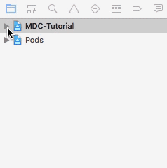
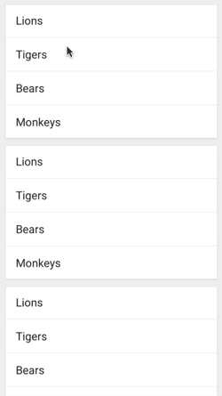
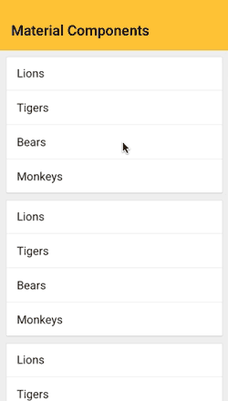
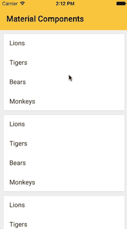

<!---->
See <a href="https://material-ext.appspot.com/mdc-ios-preview/">MDC site documentation</a> for richer experience.
<!--See <a href="https://github.com/google/material-components-ios">GitHub</a> for README documentation.-->

## Tutorial

This tutorial will teach you how to link Material Components to an application, use a material collection view, and add an expandable app bar at the top of your controller.

---

## 1.  Create a new Xcode application:

Open Xcode. If the launch screen is present, click `Create a new Xcode project` or go to menu `File -> New -> Project…`. 

In the template window, select `iOS` as the platform and `Single View Application` as the Application type. Click `Next`.
  
Name your project `MDC-Tutorial` and choose your preferred language. Click `Next`.
  
Choose a place to save your new project that you can remember. Click `Create`.
  
Close your new project by going to menu `File -> Close Project` or holding `option + command + w`. We’ll come back to the project in a minute.
  
## 2.  Setup CocoaPods:
Open `Terminal`.

If you do not already have CocoaPods installed on this system, run:

~~~ bash
        
sudo gem install cocoapods
~~~

Navigate to your project's directory and create a `Podfile` by running:

~~~ bash
        
cd [directory of your project]
pod init
~~~ 

Open the new `Podfile` in a text editor or by running:

~~~ bash
        
open -a Xcode Podfile
~~~

Add the `Material Components` pod to the `Podfile`:

~~~ ruby
        
target 'MDC-Tutorial' 
use_frameworks!
    
# Pods for MDC-Tutorial
pod 'MaterialComponents', :git => 'https://github.com/google/material-components-ios.git'
    
end
~~~ 

**NOTE:** If the language you’re using in this project is Objective-C, comment out `use_frameworks` by adding a `#` in front of it.

Save the `Podfile`.

Back in `Terminal`, install your new pod and open the generated workspace:

~~~ bash
        
pod install
open MDC-Tutorial.xcworkspace
~~~

## 3.  Add a Material Collection View:
In Xcode, select `ViewController.swift` or `ViewController.h`. 

Then import Material Collections and set `ViewController`’s superclass to `MDCCollectionViewController`:

##### Swift (ViewController.swift):

~~~ swift
import UIKit
import MaterialComponents.MaterialCollections

class ViewController: MDCCollectionViewController {

  override func viewDidLoad() {
    super.viewDidLoad()

  }

}
~~~

##### Objective-C (ViewController.h):

~~~ objc
#import <UIKit/UIKit.h>
#import "MaterialCollections.h"

@interface ViewController : MDCCollectionViewController

@end
~~~
        
Open `Main.storyboard` and delete the default view controller that came with it. Then drag a new Collection View Controller on to the storyboard, change the Custom Class of that view controller to `ViewController`, and set `Is Initial View Controller` to `true`. 
    
Select the prototype cell and set its custom class to `MDCCollectionViewTextCell`, 

then set its reuse identifier to `cell`:

In `viewDidLoad`, configure the collection view’s appearance:

~~~swift
import UIKit
import MaterialComponents.MaterialCollections

class ViewController: MDCCollectionViewController {

  override func viewDidLoad() {
    super.viewDidLoad()

    styler.cellStyle = .card
  }

}
~~~
        
Below `viewDidLoad`, add a mock datasource:

~~~ swift
import UIKit
import MaterialComponents.MaterialCollections

class ViewController: MDCCollectionViewController {

  override func viewDidLoad() {
    super.viewDidLoad()

    styler.cellStyle = .card
  }

  override func numberOfSections(in collectionView: UICollectionView) -> Int {
    return 5
  }

  override func collectionView(_ collectionView: UICollectionView, numberOfItemsInSection section: Int) -> Int {
    return 4
  }

  override func collectionView(_ collectionView: UICollectionView, cellForItemAt indexPath: IndexPath) -> UICollectionViewCell {
    let cell = collectionView.dequeueReusableCell(withReuseIdentifier: "cell", for: indexPath)

    if let textCell = cell as? MDCCollectionViewTextCell {

    // Add some mock text to the cell.
    let animals = ["Lions", "Tigers", "Bears", "Monkeys"]
    textCell.textLabel?.text = animals[indexPath.item]

    }

    return cell
  }

}
~~~
        
Build and run your app. It should display a scrollable, touchable collection view:

## 4.  Add an app bar:
Add the property declaration to the top of the class:

~~~ swift
import UIKit
import MaterialComponents.MaterialCollections

class ViewController: MDCCollectionViewController {

  let appBar = MDCAppBar()

  override func viewDidLoad() {
    super.viewDidLoad()

    styler.cellStyle = .card
  }...
~~~

Configure the app bar in `viewDidLoad`:

~~~ swift
import UIKit
import MaterialComponents

class ViewController: MDCCollectionViewController {

  let appBar = MDCAppBar()

  override func viewDidLoad() {
    super.viewDidLoad()

    styler.cellStyle = .card

    addChildViewController(appBar.headerViewController)
    appBar.headerViewController.headerView.backgroundColor = UIColor(red: 1.0, green: 0.76, blue: 0.03, alpha: 1.0)

    appBar.headerViewController.headerView.trackingScrollView = self.collectionView
    appBar.addSubviewsToParent()

    title = "Material Components"
  }
~~~
    
Build and run your app. It should display a white rectangle above the collection view: 

But if you pull down, it doesn’t expand at all.

## 5.  Make the app bar flexible by forwarding scroll view delegate methods:
Implement the UIScrollViewDelegate methods:

~~~swift
import UIKit
import MaterialComponents

class ViewController: MDCCollectionViewController {

  let appBar = MDCAppBar()

  override func viewDidLoad() {
    super.viewDidLoad()

    styler.cellStyle = .card

    addChildViewController(appBar.headerViewController)
    appBar.headerViewController.headerView.backgroundColor = UIColor(red: 1.0, green: 0.76, blue: 0.03, alpha: 1.0)

    appBar.headerViewController.headerView.trackingScrollView = self.collectionView
    appBar.addSubviewsToParent()

    title = "Material Components"
  }

  override func numberOfSections(in collectionView: UICollectionView) -> Int {
    return 5
  }

  override func collectionView(_ collectionView: UICollectionView, numberOfItemsInSection section: Int) -> Int {
    return 4
  }

  override func collectionView(_ collectionView: UICollectionView, cellForItemAt indexPath: IndexPath) -> UICollectionViewCell {
    let cell = collectionView.dequeueReusableCell(withReuseIdentifier: "cell", for: indexPath)

    if let textCell = cell as? MDCCollectionViewTextCell {

    // Add some mock text to the cell.
    let animals = ["Lions", "Tigers", "Bears", "Monkeys"]
    textCell.textLabel?.text = animals[indexPath.item]

    }

    return cell
  }

  // MARK: UIScrollViewDelegate
    
  override func scrollViewDidScroll(_ scrollView: UIScrollView) {
    if scrollView == appBar.headerViewController.headerView.trackingScrollView {
      appBar.headerViewController.headerView.trackingScrollDidScroll()
    }
  }

  override func scrollViewDidEndDecelerating(_ scrollView: UIScrollView) {
    if scrollView == appBar.headerViewController.headerView.trackingScrollView {
      appBar.headerViewController.headerView.trackingScrollDidEndDecelerating()
    }
  }

  override func scrollViewDidEndDragging(_ scrollView: UIScrollView, willDecelerate decelerate: Bool) {
    if scrollView == appBar.headerViewController.headerView.trackingScrollView {
      let headerView = appBar.headerViewController.headerView
      headerView.trackingScrollDidEndDraggingWillDecelerate(decelerate)
    }
  }
    
  override func scrollViewWillEndDragging(_ scrollView: UIScrollView, withVelocity velocity: CGPoint, targetContentOffset: UnsafeMutablePointer<CGPoint>) {
    if scrollView == appBar.headerViewController.headerView.trackingScrollView {
      let headerView = appBar.headerViewController.headerView
      headerView.trackingScrollWillEndDragging(withVelocity: velocity, targetContentOffset: targetContentOffset)
    }
  }
}
~~~

Build and run your app. The app bar should now flex when the collection view is scrolled too far:

---

## **Next steps**

This tutorial gives a glimpse of what MDC can do. But there are a lot more components for you to discover.

Use our examples and catalog apps to try out other components and other ways to integrate them into apps.

### Sample Code

*   [Pesto: A simple recipe app, incorporating a flexible header, floating action button, and collections.](https://github.com/google/material-components-ios/tree/master/demos/Pesto)
*   [Shrine: A demo shopping app, incorporating a flexible header, custom typography, and collections.](https://github.com/google/material-components-ios/tree/master/demos/Shrine)

### For more information:

*   [Read the Component Documentation](https://github.com/google/material-components-ios/blob/develop/howto/tutorial/%7B%7B%20site.folder%20%7D%7D/components)
*   [Stack Overflow "material-components-ios"](http://stackoverflow.com/questions/tagged/material-components-ios)
